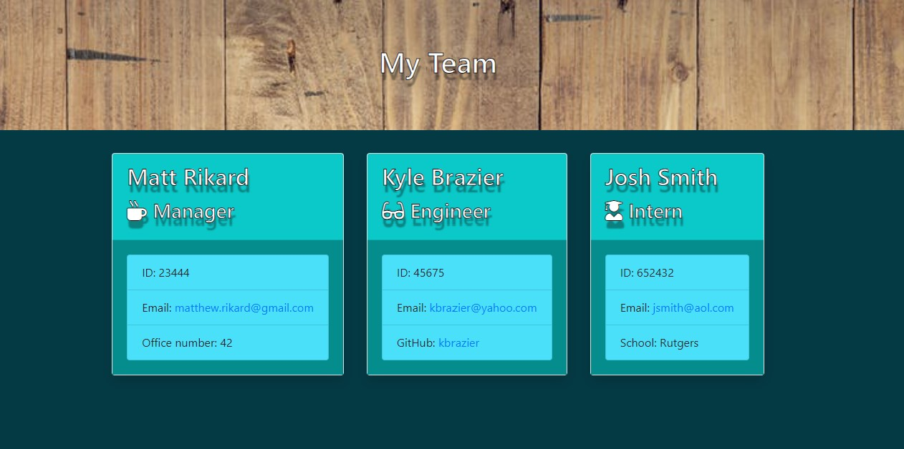

# README

## Table of Contents

[Description](#Description)

[Installation](#Installation)

[Usage](#Usage)

[ScreenShots](#Screenshots)

[License](#License)

[Contributors](#Contributors)

[Contact](#Contact)

[Tests](#Tests)

## Description

- Team generator built with node, handlebars, inquirer, and jest. On user 

## Installation

- Clone repo. "npm install" to install packages. 

## Usage

- "node app.js" to run inquirer prompts. Fill out the document. Open team.html from output directory to view auto generated page. 

## Screeshots

## License

- n/a

## Contributors

- Matt Rikard

## Contact

- To report bugs or general inquiries, you may contact me at matthew.rikard@gmail.com

## Tests

- n/a

